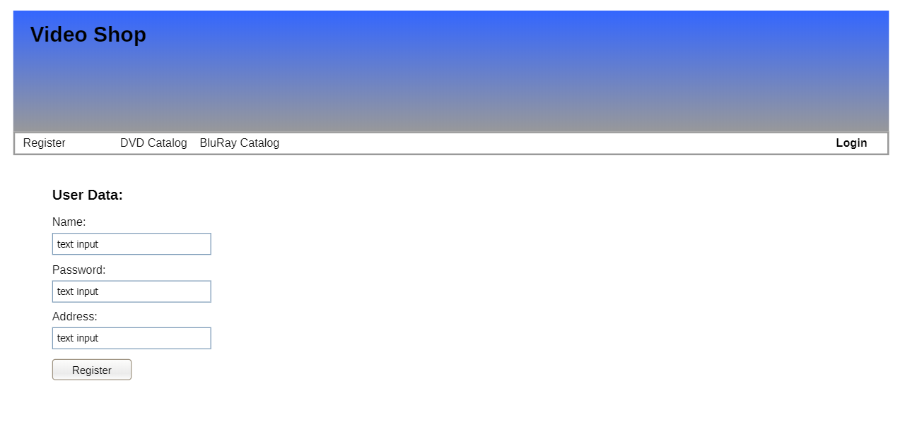

[options="header"]
[cols="1, 3, 3"]
|===
|Version | Processing Date   | Author
|1.0	| October 9th, 2017 | Marc Kandler
|2.0	| June 21st, 2019 | Daniel Schoenicke
|===

:project_name: Videoshop
= Pflichtenheft __{project_name}__
:author: Marc Kandler
:revnumber: 0.1
:revdate: {docdatetime}
:revremark: Work in Progress
:doctype: book
:icons: font
:source-highlighter: highlightjs
:toc: left
:numbered:

:company_name: Chair of Software Technology

== Purpose of this Document

This document represents the Software Requirements Specification (SRS, German: close to a "Pflichtenheft") of the project **{project_name}**.
It aims to provide an overview of the software product to be built and functions as a basis for communication between
the stakeholders of the project, mainly the client and the development team.
It is desired to have this document as the foundation for a contract between the
client and the contractor, and should therefore be validated and checked for consistency.
The SRS describes _what_ the desired system has to fulfill and _partially how_ the contractor intends to implement the solution.

In general, the SRS should be *correct, complete, and consistent* (CCC).
As it is used at the end of the project to validate whether or not the defined software has been delivered,
this goal should be *verifiable*. It is going to be used and consulted throughout the whole project which is why the contents should be *traceable* throughout all artifacts that are created.
In conjunction with the above, it is desired to be simple to change and evolve, even though changes should be kept to a minimum after the stakeholders once agreed on the content.
However, as requirements and circumstances constantly change during a project, adjustments are to be expected and have to be documented.

We aim to provide an example of a SRS, which can be used as a reference during the course "Softwaretechnolgie - Projekt" at Technische Universität Dresden (TU Dresden).
This SRS is not complete and in larger projects many more aspects can and should be considered.
The provided document is only to be used for educational purposes. Contributions are welcome.

_Note: We included several remarks in this document, just like the one you are reading right now, to provide you some additional information._
_These remarks would obviously not be in a real SRS, but are used here for educational purposes._
_Said remarks are labeled with the word "Note" and are written in italic._

_Note: You do not necessarily have to use the same table structure or formatting we used. Regardless of the presentation of the information, you should aim to provide all necessary details._

_Note: You can also split the chapters into single files and merge them (include::<filename>.adoc[]) into a single file to allow for a better distributed workflow._

== Task Definition

_Note: This task aims to provide an example for the {project_name}._
_It is written from the perspective of the client of this project ({company_name}) and therefore can be seen as a requirements specification._
_You usually cannot expect such a document to be complete or even consistent, which is why you should always ask in case of uncertainty._
_Wherever information about the domain is provided, we used_ _italic_ _to show the representation in the domain model._

The times when people went to buy their movies physically in the store are mostly over.
As we, the {company_name}, have always had our little secondary business of selling movies to students, this change affects us as well.
Therefore, we finally want to take the leap to move our business into an online shop.
We need a software, which can support all of the core aspects of our current shop and automatize processes wherever possible.

Our Shop (_Videoshop_) can have any number of users (_User_) which may interact with it differently.
Every visitor of our shop may access the catalog (_VideoCatalog_) and its whole functionality.
The catalog contains every article (_Disc_) we offer and distinguishes between DVDs (_Dvd_) and Blu-Rays (_BluRay_).
The Discs are stored in an inventory (_Inventory_), where they are represented by items (_InventoryItem_).
An item saves the current stock (_quantity_) of the Disc.
Whenever something is sold, the quantity of the item has to be reduced (_decreaseQuantity_) accordingly to represent the stock correctly.

Besides normal users in our system (_Customer_), we also want administrative access (_Boss_) to manage our shop.
Whenever a customer likes something from our catalog, he may add it (_addDisc_) to his virtual basket (_Cart_, _CartItem_) in any quantity (_quantity_) .
The contrary is obviously desired as well, to allow our customers to change their mind (_removeDisc_).
During the whole process, the customer shall obviously be able to view his selection and see total price of it (_getPrice_).
We are especially interested in the automation of the ordering process, which is why we require support for directly buying the content of the cart (_buy_).

After deciding to buy something, an order (_Order_) with the current time (_dateCreated_) is created.
It contains each of the chosen items (_OrderLine_) with their quantity (_quantity_) and price (_price_).
If the chosen item is not available in the sufficient quantity (_hasSufficientQuantity_), an error should be shown to the customer.
As long as the customer did not pay, the order is registered in the system and assigned a status (_OrderStatus_), but not yet processed (_OPEN_).
After receiving the money from the customer (_payOrder_), which he may provide through different methods (_paymentMethod_), the order may be processed further (_PAID_).
As the order is shipped to the customer, it should be archived (_completeOrder_, _COMPLETED_), as returns or refunds are ruled out :).
Should any unforeseen circumstances occur, we obviously do not want an order to be stuck in the system (_CANCELLED_).

Our shop should obviously provide the means for a visitor to register (_register_).
As we do only want registered users to have access to some functionality, a security system is required.
We do trust the state-of-the-art authentication mechanism with e-mail (_email_) and a password (_password_).
However, as we do not want to force visitors to register, they shall be able to leave a comment (_addComment_) with their opinion (_text_) and a rating (_rating_) for every disc in the catalog.

All in all, we want a nice, fast and secure system, which allows us to administrate all of our customers and the stock.
It should support our ordering process and allow us to manage everything related to it.
The user experience should be awesome, with a beautiful user interface and a layout, which boosts our sales.

[small]_Note: Especially the last paragraph contains close to no information. In such cases, you have to get more and concrete information regarding requirements from the client._ +
[small]_The paragraph as it stands there could pretty much mean anything and force you into critical situations at the end of the project, if the regarding concerns are not addressed appropriately in the rest of the SRS._

== Product Usage

This section is going to give an overview of how the product is intended to be used upon completion and under which circumstances.

The system is going to be used as a web shop by the {company_name} to sell movies (discs) to students.
The software is supposed to run on a server and be available through the internet (via a browser) to interested customers 24/7.

The system shall be accessible and visually optimized for the following browsers:

- Mozilla Firefox, version 55.0.3+
- Google Chrome, version 61.0.3163+

The primary users of the software are students (customers), who supposedly know typical website navigation schemas, as well as administrators (Boss),
who do not necessarily have a technical background.

The system shall not need technical maintenance, as the staff of the {company_name} already has its hands full.
Any data shall be stored persistently in a database and be accessible through the application (e.g. no SQL knowledge should be required for a boss).

[[Stakeholders]]
== Stakeholders
Here is every group or individual (real or juristical) listed, which/who has an impact on the requirements of the system.
In the below table, these stakeholders are listed, a priority is assigned (in case requirements should clash this allows for easier decisions)
and their high-level goals are described.
The assigned priorities range from 1 (lowest priority) to 5 (highest priority).

[options="header", cols="2, ^1, 4, 4"]
|===
|Name
|Priority (1..5)
|Description
|Goals

|{company_name}
|5
|The primary client of this project.
a|
- Sell more movies
- Automate processes
- Have an example application for students
- Prevent inventory differences

|Customers (Students)
|4
|Primary user of the application, supposed to generate income
a|
- Good user experience
- Easily browsable catalog
- Fast order processing

|Administrators
|2
|Users who administer the application (e.g. overview all orders)
a|
- Possibility to overview all the data in the system
- Manage processes

|Developers
|3
|People who are either implementing the application or are responsible for maintenance later on.
a|
- Easily extendable application
- Low maintenance effort
- Good debugging mechanisms

|===

== System Boundaries and Component Structure

=== System Context Diagram

The system context diagram shows the planned system in its environment.
This includes all user types, their ways to access the system, as well as third-party systems, which
access our system or are accessed by it (not the case here).

[small]_Note: Informal graphics are usable as well (e.g. created with Visio)._

[[context_diagram]]
image:diagrams/images/videoshop_context.svg[context diagram]

=== Top-level architecture

Top-Level view of the system.

[[TLA]]
image:diagrams/images/videoshop_top_level.svg[top-level architecture]

== Use-Cases

This section will give an overview of the use cases the system has to support.
These use cases describe what functionality the system has to provide (mostly) from the client's point of view and which actors are involved.

=== Actors

Actors are users of the system or neighboring systems who/which access it.
The following table summarizes all actors of the system and provides a description of the actor.
Abstract actors (i.e. an actor which groups other actors, written in _italic_) are used to generalize and group.
// Dokumentieren Sie die Akteure in einer Tabelle.
// Diese Tabelle gibt einen Überblick über die Akteure und beschreibt sie kurz.
// Die Tabelle hat also mindestens zwei Spalten (Akteur Name und Kommentar).

// See http://asciidoctor.org/docs/user-manual/#tables
[options="header"]
[cols="1,4"]
[[registered_user]]
[[actors]]
|===
|Name |Description
|_User_               | Representative for every person, who interacts who interacts with the system, regardless if authenticated or not.
|_Registered User / Authenticated User_    | Representative for every person, who does have an account, is authenticated and interacts with the system.
|Unauthenticated User | Representative for unauthenticated access (i.e. unauthenticated visitors)
|Boss                 | Any registered (and authenticated) user, who has the Role "BOSS". Is responsible for administration of the application.
|Customer             | Any registered (and authenticated) user, who has the Role "CUSTOMER". Only role in the system, which is allowed to buy the content of the cart.
|===

=== Use-Case Diagram

[[use_case_diagram]]
image::./images/Use_Case_Diagram.png[Use Case diagram, 100%, 100%, pdfwidth=100%, title= "Use case diagram of {project_name}", align=center]

=== Use-Case Descriptions

This section describes the use cases shown in the use case diagram in detail.
_Note: It is not yet necessary to fully include all special cases and variants (scenarios) of the use case (e.g. what happens if the stock is not sufficient), but the general purpose of the system should become visible._
_Complex use cases can be shown in detail with a sequence diagram._
_Typical CRUD (create, read, update, delete) use cases can be condensed into one use case._

_Note: We did not provide a sequence diagram for every use case._

See: +
https://www.sophist.de/fileadmin/user_upload/Bilder_zu_Seiten/Publikationen/UML2_glasklar/4._Auflage/12-1_Schablone_fuer__Use-Case-Beschreibung.pdf

[cols="1h, 3"]
[[UC0010]]
|===
|ID                         |**<<UC0010>>**
|Name                       |Login/Logout
|Description                |A user shall be able to login (authenticate) with the system to access further functionality.
This process shall be reversible by logging out.
|Actors                     |User
|Trigger                    |
_Login_: User wants to access "hidden" functionality by logging in.

_Logout_: User wants to leave the shop.
|Precondition(s)           a|
_Login_: User is not authenticated yet

_Logout_: User is authenticated
|Essential Steps           a|
_Login_:

  1. User accesses "Einloggen" in the navigation bar
  2. User enters his credentials
  3. User hits "Log in" button

_Logout_:

  1. User hits "Ausloggen" in the navigation bar
  2. User is unauthenticated and is shown the home screen

|Extensions                 |-
|Functional Requirements    |<<F0010>>
|===

[cols="1h, 3"]
[[UC0020]]
|===
|ID                         |**<<UC0020>>**
|Name                       |Register
|Description                |An unauthenticated user shall be able to create an account for himself.
|Actors                     |Unauthenticated User
|Trigger                    |Unauthenticated user wants to create an account for himself by pressing "Registrieren"
|Precondition(s)           a|Actor is not logged in (authenticated) yet
|Essential Steps           a|
1.  Unauthenticated user presses "Registrieren"
2.  He enters his desired username, password, and delivery address
3.  System checks username uniqueness
  . If Unique: An account is created with the provided data
  . Otherwise: An error message is shown
|Extensions                 |-
|Functional Requirements    |<<F0020>>, <<F0021>>
|===

[[UC0100]]
[cols="1h, 3"]
|===
|ID                         |**<<UC0100>>**
|Name                       |**View Catalog**
|Description                |Every visitor of the Videoshop (i.e. *User*) shall be able to access the Catalog, which displays all the offered discs.
The Catalog must provide the possibility to distinguish between different types of Discs (Dvd, Blu-Ray).
|Actors                     |User
|Trigger                    |Accessing the navigation element, which is responsible for displaying the Catalog.
|Precondition(s)           a|None
|Essential Steps           a|1. User clicks on the navigation element named "DVD Katalog" or "BluRay Katalog".
                             2. User is shown all Discs of the selected category.
|Extensions                 |None
|Functional Requirements    | <<F0100>>, <<F0110>>, <<F0111>>, <<F0112>>
|===

[[sequence_diagram_view_catalog]]
image::./images/Sequence_Diagrams/View_Catalog.png[Sequence diagram: View Catalog, 100%, 100%, pdfwidth=100%, title= "Sequence diagram: View Catalog", align=center]

[[UC0110]]
[cols="1h, 3"]
|===
|ID                         |**<<UC0110>>**
|Name                       |View Product Details
|Description                |A user shall be able to view the details of a disc on an extra page.
|Actors                     |User
|Trigger                    |User views the catalog and presses on an entry to view the details of the disc.
|Precondition(s)           a|User is viewing the catalog.
|Essential Steps           a|
1.  User presses on a displayed entry of the catalog (disc)
2.  User is shown the details of the selected disc.
|Extensions                 |-
|Functional Requirements    | <<F0120>>
|===

[[sequence_diagram_view_catalog]]
image::./images/Sequence_Diagrams/View_Product_Details.png[Sequence diagram: View Product Details, 100%, 100%, pdfwidth=100%, title= "Sequence diagram: View Product Details", align=center]

[cols="1h,3"]
[[UC0120]]
|===
|ID                         |**<<UC0120>>**
|Name                       |Comment on Product
|Description                |A user shall be able to leave his opinion about a disc, visible to all other users.
|Actors                     |User
|Trigger                    |User wants to comment on a disc
|Precondition(s)           a|User views the details page (<<UC0110>>) of a disc.
|Essential Steps           a|
1.  User enters his textual comment on the details page of a disc
2.  User presses "Senden" to persist his comment
3.  Persisted comment is listed on the details page of the disc
|Extensions                a|
-   Only authenticated users shall be able to leave a comment
-   Only authenticated users, who bought this disc, shall be able to comment it
|Functional Requirements    | <<F0121>>
|===

[[sequence_diagram_comment_product]]
image::./images/Sequence_Diagrams/Comment_Product.png[Sequence diagram: Comment on Product, 100%, 100%, pdfwidth=100%, title= "Sequence diagram: Comment on Product", align=center]

[cols="1h,3"]
[[UC0121]]
|===
|ID                         |**<<UC0121>>**
|Name                       |Rate Product
|Description                |A user shall be able to support his comment with a rating.

_Please Note: As it is implemented, this is not a use case in itself, as the rating is part of use case <<UC0120>>._
_We decided to model it this way to show an example of the "include" in a use case diagram. The meaning would be: During the process of <<UC0120>>, <<UC0121>> is executed mandatorily (if you decide to leave a comment, it is also necessary to leave a rating)._
|Actors                     |User
|Trigger                    |User is about to comment on a disc
|Precondition(s)           a|User views the details page (<<UC0110>>) of a disc and is about to leave a comment (<<UC0120>>)
|Essential Steps           a|Actor enters a numerical rating besides the comment
|Extensions                 |-
|Functional Requirements    | <<F0121>>
|===

[cols="1h,3"]
[[UC0200]]
|===
|ID                         |**<<UC0200>>**
|Name                       |Add Product to Cart
|Description                |A registered user shall be able to add a disc of a chosen quantity to his cart.
|Actors                     |Registered User
|Trigger                    |A registered user views the details page of a disc and wants to enter it to his cart.
|Precondition(s)           a|
- Actor has authenticated with the system (i.e. is a registered user)
- Actor views the details page of a disc
|Essential Steps           a|
1.  Actor enters a desired quantity for the selected disc (1..5)
2.  Actor presses "zum Warenkorb hinzufügen"
3.  Disc is added to his cart with the selected quantity
|Extensions                 |-
|Functional Requirements    | <<F0200>>, <<F0201>>
|===

[[sequence_diagram_Add_Product_to_Cart]]
image::./images/Sequence_Diagrams/Add_Product_to_Cart.png[Sequence diagram: Add Product to Cart, 100%, 100%, pdfwidth=100%, title= "Sequence diagram: Add Product to Cart", align=center]

[cols="1h,3"]
[[UC0210]]
|===
|ID                         |**<<UC0210>>**
|Name                       |View Cart
|Description                |A registered user shall be able to view the contents of his cart and the total price of his choice.
|Actors                     |Registered User
|Trigger                    |Actor presses "Warenkorb" in the navigation bar
|Precondition(s)           a|
- Actor has authenticated with the system (i.e. is a registered user)
|Essential Steps           a|
1.    Actor presses "Warenkorb" in the navigation bar
2.    Actor is shown the content of his cart as well as he total price of it
|Extensions                 |-
|Functional Requirements    | <<F0210>>
|===

[cols="1h,3"]
[[UC0220]]
|===
|ID                         |**<<UC0220>>**
|Name                       |Buy Products in Cart
|Description                |A customer shall be able to buy the content of his cart.
|Actors                     |Customer
|Trigger                    |Customer
|Precondition(s)           a|
- Actor is authenticated and has the role "CUSTOMER" in the system
- Cart is not empty
|Essential Steps           a|
1.  (Customer has put at least one item into his cart (<<UC0200>>))
2.  Customer presses "Buy"
3.  Order is checked against stock
4.  Order is paid automatically
5.  Discs are removed from the inventory in the chosen quantity
6.  Order is archived
|Extensions                 |
|Functional Requirements    | <<F0101>>, <<F0220>>, <<F0230>>, <<F0240>>, <<F0241>>, <<F0242>>, <<F0243>>
|===

[[sequence_diagram_Buy_Products_in_Cart]]
image::./images/Sequence_Diagrams/Buy_Products_in_Cart.png[<Image removed for educational purposes. Such a complex use case does definitely need to be shown in detail with a sequence diagram.>, 100%, 100%, pdfwidth=100%, title= "<Image removed for educational purposes.>", align=center]

[cols="1h,3"]
[[UC0300]]
|===
|ID                         |**<<UC0300>>**
|Name                       |View Customer List
|Description                |A Boss should be able to view the whole list of customers of the application.
|Actors                     |Boss
|Trigger                    |Boss selects "Kunden" in the navigation bar
|Precondition(s)           a|User is authenticated and has role "Boss"
|Essential Steps           a|
1.  Boss selects "Kunden" in the navigation bar
2.  Complete list of all registered users with the role "customer" is shown
|Extensions                 |-
|Functional Requirements    | <<F0300>>
|===

[cols="1h,3"]
[[UC0310]]
|===
|ID                         |**<<UC0310>>**
|Name                       |View Orders
|Description                |A boss shall be able to view a list of completed orders.
|Actors                     |Boss
|Trigger                    |Boss selects "Bestellungen" in the navigation bar
|Precondition(s)           a|User is authenticated and has role "Boss"
|Essential Steps           a|
1.  Boss selects "Bestellungen" in the navigation bar
2.  Complete list of all completed orders is shown
|Extensions                 |-
|Functional Requirements    | <<F0310>>
|===

[[sequence_diagram_View_Orders]]
image::./images/Sequence_Diagrams/View_Orders.png[Sequence diagram: View Orders, 100%, 100%, pdfwidth=100%, title= "Sequence diagram: View Orders", align=center]

[cols="1h,3"]
[[UC0320]]
|===
|ID                         |**<<UC0320>>**
|Name                       |View Inventory
|Description                |A boss shall be able to view the inventory including the current stock.
|Actors                     |Boss
|Trigger                    |Boss selects "Lager" in the navigation bar
|Precondition(s)           a|User is authenticated and has role "Boss"
|Essential Steps           a|
1.  Boss selects "Lager" in the navigation bar
2.  Complete list of all items of the inventory and the current stock is shown
|Extensions                 |-
|Functional Requirements    | <<F0100>>, <<F0320>>
|===

== Functional Requirements

This section gives an overview of the functional requirements of the system.

The table contains:

  - A unique identifier of the requirement (ID), which can be used for referencing throughout the project
  - The current version of the requirement, as changes to a requirement can happen throughout the project
  - A short name of the requirement
  - The description of the requirement

_Note: A functional requirement defines a function of the system, which shall be implemented to satisfy the customer needs (e.g. as shown through use cases)._
_Ideally, it contains a set of inputs for the functionality in question, the intended behavior, and the result of it._

_Note: Functional requirements are used to depict what exactly has to be implemented (from the developer's point of view)._
_As use cases are mostly relatively close to the domain and mostly non-technical (can even be written by a non-techie client), it is necessary to specify and organize the information provided by the client._

See (German): https://www.sophist.de/fileadmin/user_upload/Bilder_zu_Seiten/Publikationen/Wissen_for_free/MASTeR_Broschuere_3-Auflage_interaktiv.pdf

[options="header", cols="2h, 1, 3, 12"]
|===
|ID
|Version
|Name
|Description

|[[F0010]]<<F0010>>
|v0.1
|Authentication
a|
The system shall be able to be separated into publicly accessible parts, and parts which
require authentication to be accessed. If a User is existent in the system (<<registered_user, registered user>>), he or she shall be able to authenticate by providing the
following information:

* Username
* Password

|[[F0020]]<<F0020>>
|v0.1
|Registration
a|
The system shall provide an Unauthenticated User (<<F0010>>) the ability to register after
accessing the navigation element named "Registrieren".

The following information has to be provided:

* Username (unique)
* Password
* Shipping address

The system shall validate the provided data (<<F0021>>).
The user shall be registered in the system as customer and he shall be able to authenticate (<<F0010>>) after successful validation.

|[[F0021]]<<F0021>>
|v0.1
|Validate Registration
a|
The system shall be able to validate the provided data of an unregistered user.

The uniqueness of the username has to be guaranteed.
The user shall be informed of any constraint violations.

|[[F0100]]<<F0100>>
|v0.1
|Inventory
a|
The system shall be able to persistently store data about Discs in an Inventory.

|[[F0101]]<<F0101>>
|v0.1
|Reduce Quantity
a|
The system shall be able to reduce the stock of a product in the inventory.

|[[F0110]]<<F0110>>
|v0.1
|Catalog
a|
The system shall be able to provide read-only access on existing Discs (<<F0100>>) through a Catalog.

|[[F0111]]<<F0111>>
|v0.1
|View Catalog
a|
The system shall provide a User the ability view the contents of the Catalog.

|[[F0112]]<<F0112>>
|v0.1
|Filter catalog
a|
The system shall provide a user the ability to view discs in the catalog filtered by a chosen category (i.e. Dvd or BluRay)

|[[F0120]]<<F0120>>
|v0.1
|View Product Details
a|
The system shall provide a user the ability to view the details of a Disc after clicking on it. +
The following details have to be displayed:
- Title of the disc
- Price of the disc
- Genre of the disc
- Current stock
- Cover image of the disc
- Submitted comments

|[[F0121]]<<F0121>>
|v0.1
|Comment on Product
a|
The system shall provide a user the ability to submit a comment for a product.

A comment consists of:
- A textual opinion regarding the disc
- A numerical rating for the disc (low = bad rating, high = good rating)

_Note: As we have explained in the respective use case, the comment functionality essentially includes the rating._
_While the client might have described these functions as two potentially different use cases, further domain analysis has led to the conclusion, that we can combine them, as happened with this functional requirement_

|[[F0200]]<<F0200>>
|v0.1
|Cart
a|
The system shall provide every registered and authenticated user with a cart, in which he can temporarily store selected products.

The cart shall be transiently persistent and be unique to every user.

|[[F0201]]<<F0201>>
|v0.1
|Add Product to Cart
a|
The system shall provide a registered and authenticated user to add a product to his cart in the desired quantity.

Upon adding a product, an entry shall be created in the cart of the authenticated user.

Unauthenticated users shall be prompted to authenticate to view their cart.

|[[F0210]]<<F0210>>
|v0.1
|View Cart
a|
The system shall provide an authenticated user the ability to access his cart.
The cart shall list the following:

- Movie title
- Selected Quantity
- Total price for each movie (movie price x movie quantity)
- Total price of the cart

|[[F0220]]<<F0220>>
|v0.1
|Buy Products in Cart
a|
The system shall provide an authenticated user the ability to buy the content of his cart.

Upon attempting to buy the content of the cart, the potential order has to be validated (<<F0230>>).
An order shall be created, if the stock is sufficient (<<F0241>>).

|[[F0230]]<<F0230>>
|v0.1
|Validate Sufficient Stock
a|
The system shall be able to validate if the current stock of a product matches at least a desired quantity.

|[[F0240]]<<F0240>>
|v0.1
|Orders
a|
The system shall be able to persistently store orders.

|[[F0241]]<<F0241>>
|v0.1
|Create Order
a|
The system shall be able to create an order from the contents of a cart.

An order shall be initialized with the status "OPEN".

|[[F0242]]<<F0242>>
|v0.1
|Pay Order
a|
The system shall provide the functionality to pay an existing "OPEN" order with different payment methods.

After the order was paid, its status shall be set to "PAID".

|[[F0243]]<<F0243>>
|v0.1
|Archive Order
a|
The system shall be able to archive an order.

An order is archived by setting its status to "COMPLETED".

|[[F0300]]<<F0300>>
|v0.1
|View Customer List
a|
The system shall provide a boss the functionality to view all customers who are registered in the system.

|[[F0310]]<<F0310>>
|v0.1
|View Orders
a|
The system shall provide a boss the functionality to view all orders with the status "COMPLETED".

The following information shall be shown for each order:
- Timestamp of creation
- Customer who issued the order
- Total paid price of the order

|[[F0320]]<<F0320>>
|v0.1
|View Inventory
a|
The system shall provide a boss the functionality to view the inventory and the current stock.

The following information shall be shown for each product:

- Name of the disc
- Current stock (quantity)

|===

== Non-Functional Requirements

This section is going to give an overview of non-functional (NF) requirements of the project {project_name}.
These requirements describe how the system works and within which boundaries it is supposed to perform.

_Note: We only picked two small examples of requirements to show which aspects could be considered in this chapter._

=== Quality Demands

The following table shows what quality demands have to be fulfilled to which extent.
The first column lists the quality demands, while in the following columns an "x" is used to mark the priority.
The assigned priority has to be considered in the formulation of the concrete non-functional requirements.

_Note: This is only an abstract example which is derived from the current version of the Videoshop._
_The priority may vary drastically depending on the project, and even many more aspects could be considered._
_Additionally, you should provide explanations for the demands, as to avoid any misunderstandings._

1 = Not Important ..
5 = Very Important
[options="header", cols="3h, ^1, ^1, ^1, ^1, ^1"]
|===
|Quality Demand           | 1 | 2 | 3 | 4 | 5
|Maintainability          |   |   |   | x |
|Usability                |   |   | x |   |
|Security                 |   |   |   | x |
|===

_Note: It might be necessary to provide a description of the above quality demands, as they are mostly ambiguous or the meaning is unclear._

=== Concrete NF Requirements
:desired-uptime: 99,5%

[options="header", cols="2h, 1, 3, 12"]
|===
|ID
|Version
|Name
|Description

|[[NF0010]]<<NF0010>>
|v0.1
|Availability - uptime
a|
The system shall achieve at least **{desired-uptime}** uptime.

|[[NF0020]]<<NF0020>>
|v0.1
|Security - Password storage
a|
Passwords of Users shall only be stored as hash-values to prevent theft.

|===

== GUI Prototype

The following pictures show what the GUI of the system could look like.
_Note: We obviously used the finished product in this SRS._
_However, the prototype is supposed to be just that. It should give the client an understanding of how the contractor intends to implement and design the solution._
_The more details you can already finalize, the better, but generally a more abstract design is sufficient at this point (depending on the client and project, even a dialog roadmap is sufficient)._
_A better structure than in this example can also be benefitial in case the GUI or the navigation is more complex._
_It it not necessary to include every single desired page in the prototype, just the crucial functionalities/pages, as discussed with the client._

_Note: It is pretty astonishing how close the prototype in this example already is to the final design, isn't it? ;)_

[[home_image]]

[[register_image]]

[[dvdcatalog_image]]
image::./images/gui/dvdcatalog.PNG[DVD catalog, 100%, 100%, pdfwidth=100%, title= "DVD catalog of {project_name}", align=center]

[[bluraycatalog_image]]
image::./images/gui/bluraycatalog.PNG[Blu Ray catalog, 100%, 100%, pdfwidth=100%, title= "Blu Ray catalog of {project_name}", align=center]

[[detail_image]]
image::./images/gui/detail.PNG[Product detail page, 100%, 100%, pdfwidth=100%, title= "Product detail page of {project_name}", align=center]

[[authenticated_home_hans_image]]
image::./images/gui/authenticated_home_hans.PNG[Landing page for an authenticated customer, 100%, 100%, pdfwidth=100%, title= "Landing page for an authenticated customer of {project_name}", align=center]

[[cart_image]]

[[authenticated_home_boss_image]]
image::./images/gui/authenticated_home_boss.PNG[Landing page for an authenticated boss, 100%, 100%, pdfwidth=100%, title= "Landing page for an authenticated boss of {project_name}", align=center]

[[order_list_image]]
image::./images/gui/order_list.PNG[Order list, 100%, 100%, pdfwidth=100%, title= "Overview page of all completed orders of {project_name}", align=center]

[[inventory_stock_list_image]]
image::./images/gui/inventory_stock_list.PNG[Inventory overview page, 100%, 100%, pdfwidth=100%, title= "Inventory overview page of {project_name}", align=center]

[[customer_list_image]]
image::./images/gui/customer_list.PNG[Customer list page, 100%, 100%, pdfwidth=100%, title= "Customer overview page of {project_name}", align=center]

== Data Model

=== Class Diagram
The (analysis) class diagram is supposed to give an overview of the domain in the context of the system, which shall be developed in the scope of this project.

_Note: This domain model is relatively close to the actual implementation and therefore partially contains implementation knowledge._
_You can be more abstract with your diagram and focus more on actual concepts of the domain you are supposed to model._

[[AKD]]
image::./images/Class_diagram_(analysis).png[Class diagram, 100%, 100%, pdfwidth=100%, title= "Domain model of {project_name}", align=center]

=== Classes and Enumerations
The following table gives an overview of the classes/enumerations used in the domain model.
Therefore, this section is a subset of the <<Glossary, glossary>> and shall be used to provide every stakeholder a common understanding of central terms and concepts of the domain of the system.

:Videoshop_Description: Central class of the system representing the videoshop itself.
//Note: you could do it like this, but this might not work with mutli-line texts. Consult the documentation for additional information

// See http://asciidoctor.org/docs/user-manual/#tables
[options="header", cols="1h, 4"]
[[classes_enumerations]]
|===
|Class/Enumeration      |Description
|BluRay                 |A BluRay is a possible type of a disc, used to group discs in the catalog.
|Cart                   |A Cart is a temporary storage for discs a customer intends to buy. If a customer decides to buy his selected discs, an order is created.
|CartItem               |A CartItem is is an element of a Cart and used to represent which discs a customer intends to buy with which quantity.
_Note: See "Note" of OrderLine_
|ChargeLine             |A ChargeLine is used to handle the payment process. For each OrderLine, there is a ChargeLine. An order is fully paid, if all of its ChargeLines are processed.
|Comment                |A Comment is a textual remark/opinion of a user regarding a disc and includes a rating (see amazon comments/ratings).
|Dvd                    |A Dvd is a possible type of a disc, used to group discs in the catalog.
|Inventory              |An Inventory represents its real-world counterpart and is used to store items like discs. Can be seen like a warehouse in this project.
|InventoryItem          |Stored discs in an inventory are represented by InventoryItems. Compared to the real world, an InventoryItem would be a box of _n_ discs of the same name.
_Note: See "Note" of OrderLine_
|Order                  |An order is used to represent what a customer of the shop intends to buy from the shop, at which price and with which payment method. An Order can have a varying status to symbolize the current step at which the order is processed.
|OrderLine              |An OrderLine represents one kind of disc the customer has ordered, as well as in which quantity. +
_Note: If an order would directly consist out of discs, we would run into the problem that there is no quantity attribute to quantitize the amount of one disc the customer has ordered._
|OrderManager           |An OrderManager represents a class that has knowledge of all existing orders and may handle compound functionality like the payment of an order.
|OrderStatus            |This status represents the current processing step of the order it belongs to. +
_OPEN_: The Order has been created by the system, but not yet processed. +
_PAID_: The customer has paid his order, the disc quantity still has to be reduced in the inventory to finalize the order. +
_COMPLETED_: The order was been paid and shipped to the customer. +
_CANCELLED_: Fallback to allow to mark failed orders or other problems.
|ROLE/Role              |A Role is used to distinguish authenticated users with different rights in the system. According to the role, different functionality becomes available.
|User                   |General representation of a real person, which has a representation in the system. This representation is only created if a user registers with the system, and only used if he or she authenticates.
|Videoshop              | {Videoshop_Description}
|===

== Acceptance Testing

Acceptance tests are used to determine, whether or not the delivered software system fulfills the requirements of the client during the actual usage.
The following table shows which acceptance tests the software system does have to pass at the end of the project in order to satisfy the client and complete the contract (regarding the requirements).

_Note: Acceptance tests can be derived from the use cases and the respective sequence diagrams, but also from other parts of the SRS._
_Each sequence diagram represents one scenario of a use case (e.g. successful order completion)._
_However, another scenario of the same use case (e.g. failed order because of insufficient stock) would require an own sequence diagram as well as at least an own acceptance test._
_It is also highly necessary to design the test cases in a measurable manner to be able to determine if the acceptance test has passed or not._

_Note: There are multiple different types of acceptance tests. In this course, we mainly focus on documenting test cases, which show that the functional requirements are fulfilled from the perspective of the user (UAT)._

:Pre: Precondition(s)
:Event: Event
:Result: Expected Result

[cols="1h, 4"]
|===
|ID            |<<AT0010>>
|Use Case      |<<UC0010>>
|{Pre}        a|The system has existing users.
|{Event}      a|An unauthenticated user accesses the login screen, enters the credentials of an existing user of the system (hans, 123) and presses "Login"
|{Result}     a|
- The user is now authenticated as "hans"
- The user is redirected to a welcome screen, which displays a personalized welcome message
- The user has now access to every functionality, which are accessible to users with the role "Customer"
|===

[cols="1h, 4"]
|===
|ID            |<<AT0011>>
|Use Case      |<<UC0010>>
|{Pre}        a|An authenticated user is using the system
|{Event}      a|The authenticated user presses "Ausloggen"
|{Result}     a|
- He becomes unauthenticated
- He loses all access to functionality only open to authenticated users or certain roles
|===

[cols="1h, 4"]
|===
|ID            |<<AT0020>>
|Use Case      |<<UC0020>>
|{Pre}        a|An unauthenticated user is using the system
|{Event}      a|The unauthenticated user presses "Registrieren" in the navigation bar and enters the following information:

- _Name:_ TestCustomer
- _Passwort:_ 123
- _Adresse:_ Nöthnitzer Straße 46

Finally, he presses "Registrieren" to send the information.
|{Result}     a|
- An new Customer with the provided data is created
- It is possible to authenticate with the credentials of the created customer
- The unauthenticated user is still unauthenticated and redirected to the landing page of the Videoshop
|===

[cols="1h, 4"]
|===
|ID            |<<AT0021>>
|Use Case      |<<UC0020>>
|{Pre}        a|An unauthenticated user is using the system
|{Event}      a|The unauthenticated user presses "Registrieren" in the navigation bar and enters the following information:

- _Name:_ hans
- _Passwort:_ 123
- _Adresse:_ Nöthnitzer Straße 46

Finally, he presses "Registrieren" to send the information.
|{Result}     a|
- An error message is shown to inform the user about the problem (user already exists)
|===

[cols="1h, 4"]
[[AT0100]]
|===
|ID            |<<AT0100>>
|Use Case      |<<UC0100>>
|{Pre}        a|A user is using the system
|{Event}      a|The user presses "DVD Katalog" in the navigation bar
|{Result}     a|The user is shown an overview of all existing discs that are DVDs (8 different discs)
|===

[cols="1h, 4"]
[[AT0101]]
|===
|ID            |<<AT0101>>
|Use Case      |<<UC0100>>
|{Pre}        a|A user is using the system
|{Event}      a|The user presses "BluRay Katalog" in the navigation bar
|{Result}     a|The user is shown an overview of all existing discs that are BluRays (9 different discs)
|===

[cols="1h, 4"]
|===
|ID            |<<AT0110>>
|Use Case      |<<UC0110>>
|{Pre}        a|A user is using the system and is either viewing the DVD catalog (<<AT0100>>) or the BluRay catalog (<<AT0101>>).
|{Event}      a|The user presses on one of the shown discs of the catalog.
|{Result}     a|The user is shown (on a new page) the details about the disc he selected as specified in <<F0120>>.

_Note: You could arguably describe the process in more detail, with concrete values (e.g. user selects disc named "Secretary" from the BluRay catalog, ...)_
|===

_Note: This list of acceptance tests does obviously not cover every use case. The process is mostly the same for every acceptance test case, which is why we provide only some examples to show you the ropes._

_Note: It is often also necessary to create test cases for non-functional requirements in order to prove that the requirement has been fulfilled by the finished system._

[[Glossary]]
== Glossary

The glossary contains a list of all words and phrases used in this project, which require an description to avoid misunderstandings between stakeholders.
Please also consult the list of <<actors, actors>>, the list of <<Stakeholders, stakeholders>> and the <<classes_enumerations, domain model>> for further definitions of terms.

_Note: Some terms can be used regularily during a project, while all involved stakeholders think that the meaning is obvious. This not necessarily the case though, as different domains of expertise can mean different levels of knowledge or simply a different understanding of a term._ +
_An example from a previous year of this course:_ +
_Imagine a shift schedule, where every shift is occupied by 3 different kinds of staff._
_The manager responsible for the schedule would use the term "shift" to describe the whole timeslot with all 3 involved staff members (e.g. "shift X is gonna be hard for you guys, prepare yourselves")._
_One of the staff members occupying one of these slots would use the term "shift" to describe his one slot (of the three) in one timeslot of the day (e.g. "My shift this time puts me in touch with the customers, while the other two can relax in the warehouse")._ +
_While this is common sense and does not really affect communication in the real world, it becomes an issue if you have to design a system which represents such a shift schedule. You could - in this case - use "shift" as in the understanding of the manager and use "slot" or "cell" to model what the staff member meant._
_In such cases, you have to force all stakeholders to use this common wording in order to avoid misunderstandings._

:Client_Description: Synonym for the customer of this project ({company_name})
:domain_ref: See <<classes_enumerations, domain overview>>
//Note: you could do it like this, but this might not work with mutli-line texts. Consult the documentation for additional information

[options="header", cols="1h, 4"]
[[glossar]]
|===
|Term                   |Description
|Administrator          | Synonym for a Boss
|BluRay                 | {domain_ref}
|Cart                   | {domain_ref}
|CartItem               | {domain_ref}
|ChargeLine             | {domain_ref}
|Client                 | {Client_Description}
|Comment                | {domain_ref}
|Contractor             | Company responsible for implementing the software
|Dvd                    | {domain_ref}
|Inventory              | {domain_ref}
|InventoryItem          | {domain_ref}
|Login                  | Successful authentication after entering the correct (i.e. existing) credentials of a user
|Order                  | {domain_ref}
|OrderLine              | {domain_ref}
|OrderManager           | {domain_ref}
|OrderStatus            | {domain_ref}
|Product                | Abstraction of a disc. Every disc is a product.
|Register/Registration  | Process of creating a new account in the system (i.e. a new user representation)
|ROLE/Role              | {domain_ref}
|Stock                  | Amount of discs of one type that are available
|System                 | General term for the software system that has to be implemented during this project.
|User                   | {domain_ref}
|Videoshop              | {Videoshop_Description}
|===
