[options="header"]
[cols="1, 3, 3"]
|===
|Version | Processing Date   | Author 
|1.0	| September 26th, 2019 | Daniel Schoenicke 
|===

:project_name: Videoshop
:company_name: Chair of Software Technology
:toc: left
:numbered:

= Developer Documentation

== Introduction and Goals
=== Task Definition

_Note: This task aims to provide an example for the {project_name}._
_It is written from the perspective of the client of this project ({company_name}) and therefore can be seen as a requirements specification._
_You usually cannot expect such a document to be complete or even consistent, which is why you should always ask in case of uncertainty._
_Wherever information about the domain is provided, we used_ _italic_ _to show the representation in the domain model._

The times when people went to buy their movies physically in the store are mostly over.
As we, the {company_name}, have always had our little secondary business of selling movies to students, this change affects us as well.
Therefore, we finally want to take the leap to move our business into an online shop.
We need a software, which can support all of the core aspects of our current shop and automatize processes wherever possible.

Our Shop (_Videoshop_) can have any number of users (_User_) which may interact with it differently.
Every visitor of our shop may access the catalog (_VideoCatalog_) and its whole functionality.
The catalog contains every article (_Disc_) we offer and distinguishes between DVDs (_Dvd_) and Blu-Rays (_BluRay_).
The Discs are stored in an inventory (_Inventory_), where they are represented by items (_InventoryItem_).
An item saves the current stock (_quantity_) of the Disc.
Whenever something is sold, the quantity of the item has to be reduced (_decreaseQuantity_) accordingly to represent the stock correctly.

Besides normal users in our system (_Customer_), we also want administrative access (_Boss_) to manage our shop.
Whenever a customer likes something from our catalog, he may add it (_addDisc_) to his virtual basket (_Cart_, _CartItem_) in any quantity (_quantity_) .
The contrary is obviously desired as well, to allow our customers to change their mind (_removeDisc_).
During the whole process, the customer shall obviously be able to view his selection and see total price of it (_getPrice_).
We are especially interested in the automation of the ordering process, which is why we require support for directly buying the content of the cart (_buy_).

After deciding to buy something, an order (_Order_) with the current time (_dateCreated_) is created.
It contains each of the chosen items (_OrderLine_) with their quantity (_quantity_) and price (_price_).
If the chosen item is not available in the sufficient quantity (_hasSufficientQuantity_), an error should be shown to the customer.
As long as the customer did not pay, the order is registered in the system and assigned a status (_OrderStatus_), but not yet processed (_OPEN_).
After receiving the money from the customer (_payOrder_), which he may provide through different methods (_paymentMethod_), the order may be processed further (_PAID_).
As the order is shipped to the customer, it should be archived (_completeOrder_, _COMPLETED_), as returns or refunds are ruled out :).
Should any unforeseen circumstances occur, we obviously do not want an order to be stuck in the system (_CANCELLED_).

Our shop should obviously provide the means for a visitor to register (_register_).
As we do only want registered users to have access to some functionality, a security system is required.
We do trust the state-of-the-art authentication mechanism with e-mail (_email_) and a password (_password_).
However, as we do not want to force visitors to register, they shall be able to leave a comment (_addComment_) with their opinion (_text_) and a rating (_rating_) for every disc in the catalog.

All in all, we want a nice, fast and secure system, which allows us to administrate all of our customers and the stock.
It should support our ordering process and allow us to manage everything related to it.
The user experience should be awesome, with a beautiful user interface and a layout, which boosts our sales.

=== Quality Demands

To measure the quality of the application, quality demands have to be defined, which have to be fulfilled. 
_Note: The following descriptions are derived from the https://iso25000.com/index.php/en/iso-25000-standards/iso-25010[ISO/IEC 25010 Software Quality Model^].

Maintainability::
This characteristic represents the degree of effectiveness and efficiency with which a product or system can be modified to improve it, correct it or adapt it to changes in environment, and in requirements.

Usability::
Degree to which a product or system can be used by specified users to achieve specified goals with effectiveness, efficiency and satisfaction in a specified context of use.

Security::
Degree to which a product or system protects information and data so that persons or other products or systems have the degree of data access appropriate to their types and levels of authorization.

The following table shows what quality demands have to be fulfilled to which extent.
The first column lists the quality demands, while in the following columns an "x" is used to mark the priority.
The assigned priority has to be considered in the formulation of the concrete non-functional requirements.

1 = Not Important ..
5 = Very Important
[options="header", cols="3h, ^1, ^1, ^1, ^1, ^1"]
|===
|Quality Demand           | 1 | 2 | 3 | 4 | 5
|Maintainability          |   |   |   | x |
|Usability                |   |   | x |   |
|Security                 |   |   |   | x |
|===

== Constraints
=== Hardware Specifications
A list of necessary devices / hardware to run and use the application.

* Server
* Computer
* Keyboard
* Mouse

=== Software Specifications
A list of necessary software to run and use the application.

The following (or newer) Java version is necessary to run the application:

* Java 11

The following (or newer) browser versions are necessary to use the application:

* Internet Explorer / Edge 10.0
* Firefox 4.0
* Google Chrome 4.0
* Opera 9.6

=== Product Usage
This section is going to give an overview of how the product is intended to be used upon completion and under which circumstances.

The system is going to be used as a web shop by the {company_name} to sell movies (discs) to students.
The software is supposed to run on a server and be available through the internet (via a browser) to interested customers 24/7.

The primary users of the software are students (customers), who supposedly know typical website navigation schemas, as well as administrators (Boss),
who do not necessarily have a technical background.

The system shall not need technical maintenance, as the staff of the {company_name} already has its hands full.
Any data shall be stored persistently in a database and be accessible through the application (e.g. no SQL knowledge should be required for a boss).

== Context and Scope
=== Context Diagram
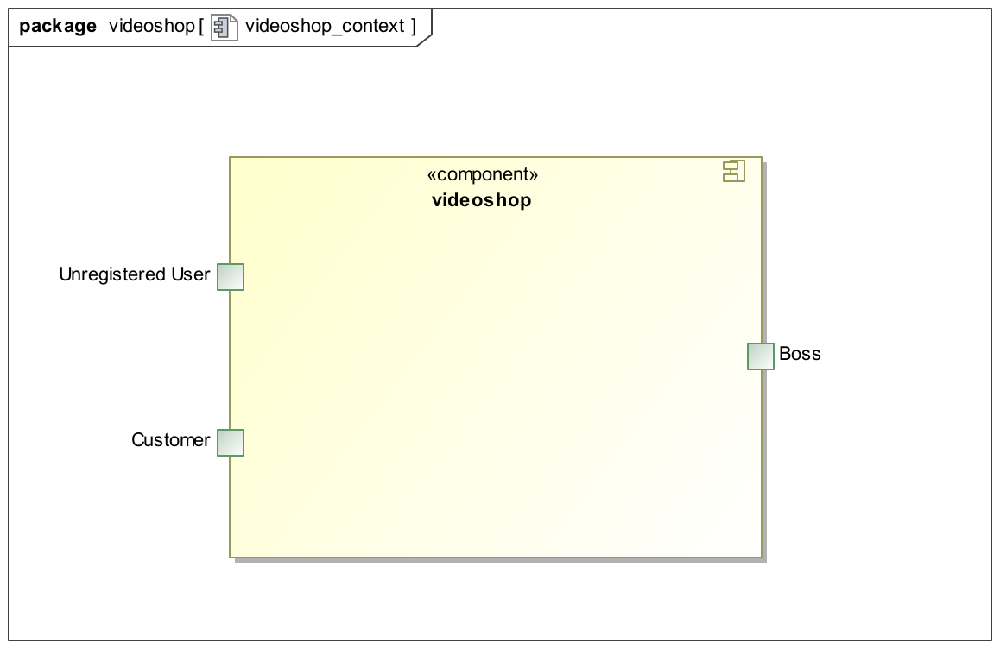

_Note: Since Salespoint and Spring Security are used in the implementation, there are no external interfaces._

== Solution Strategy
=== Quality Demand Fulfillment
_Note: The following table shows the previous defined quality demands and solution approaches to fulfill them._

[options="header"]
|=== 
|Quality Demand |Solution approach
|Maintainability a|
* *Modularity* Compose the application out of discrete components such that changes of a component have less impact on other components.
* *Reusability* Ensure that components of the system can be reused by other components or systems.
* *Modifiabilty* Ensure that the application can be modified or extended without introducing errors or degrading the product quality.
|Usability a|
* *Learnability* Ensure that the system can be easily used and understood by its users. This can be realized by e.g. unambiguously describing the content of inputs with labels or tooltips. 
* *User error protection / Error handling* Protect user against making errors. Invalid inputs must not lead to invalid system states. 
* *User interface aesthetics* Provide a pleasing and satisfying interaction for the user.
* *Accessibility* Ensure that people with a wide range of characteristics can fully use the system. This can be realized by e.g. using suitable font sizes and color contrasts. 
|Security a|
* *Confidentiality* Ensure that only data can be only accessed by people who are authorized to access them. This can be realized with _Spring Security_ and _Thymeleaf_ (`sec:authorize` - tag).
* *Integrity* Prevent unauthorized modification of data. This can be realized with _Spring Security_ (`@PreAuthorize` - annotation).
* *Accountability* Traceability of actions or event to a unambiguously entity or person. For this application, every `Order` should be linked to a `Customer`.
|===

=== Software Architecture
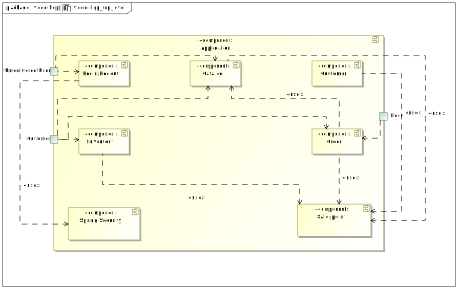

_Top Level Architecure of the application_

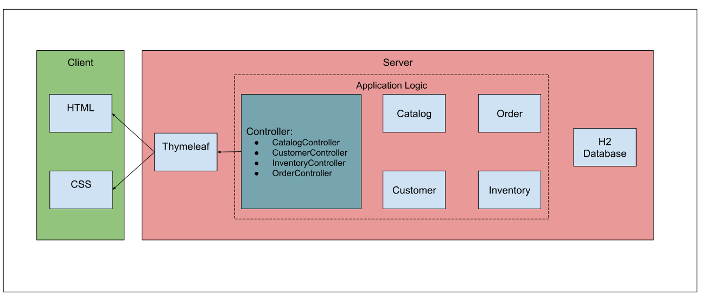

_Client Server Model of the application. The client only contains HTML and CSS files. The application logic is implemented on the server._

*Note: JavaScript is compiled by the client. You can use JavaScript in your application but make sure, that you don't use it to implement any of the application logic!*

HTML-Templates are rendered clientside with their corresponding CSS-Stylesheets. The data shown in the templates is provided by Thymeleaf. Thymeleaf receives the requested data
by the controller classes, which are implemented in the backend. These controller classes on the other hand use instances and methods of the model classes. By default, an underlying 
H2 database saves data persistently.

=== Architecture decisions

==== Design Patterns
* Spring MVC

==== Persistence
The application uses *Hibernate annotation based mapping* to map Java classes to database tables. As a database, *H2* is used.
The persistence is deactivated by default. To activate persistence storage, the following two lines in the file _application.properties_ have to be uncommented:
....
# spring.datasource.url=jdbc:h2:./db/videoshop
# spring.jpa.hibernate.ddl-auto=update
....

==== User Interface
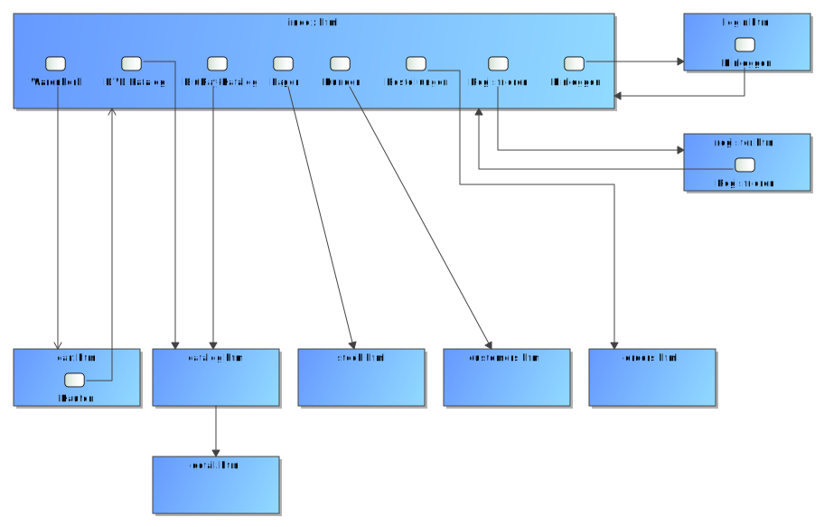

_Note: The blue boxes display a HTML-Template. The white boxes within the templates represent buttons, which redirect to the templates, their outgoing arrows point to._

==== Use of external frameworks
[options="header", cols="1,3,2"]
|===
|External Class |Path of external class |Used by (applications' class)
|Salespoint.BusinessTime |org.salespointframework.time.BusinessTime |catalog.CatalogController
|Salespoint.Cart |org.salespointframework.order.Cart| order.OrderController
|Salespoint.Cash |org.salespointframework.payment.Cash |order.OrderController
|Salespoint.Catalog |org.salespointframework.catalog.Catalog |catalog.VideoCatalog
|Salespoint.DataInitializer |org.salespointframework.core.DataInitializer a|
* catalog.CatalogInitializer
* customer.CustomerDataInitializer
* inventory.InventoryInitializer
|Salespoint.UniqueInventory |org.salespointframework.inventory.UniqueInventory a|
* catalog.CatalogController
* inventory.InventoryController
* inventory.InventoryInitializer
|Salespoint.UniqueInventoryItem |org.salespointframework.inventory.UniqueInventoryItem |inventory.InventoryInitializer
|Salespoint.Order |org.salespointframework.order.Order |order.OrderController
|Salespoint.OrderManager |org.salespointframework.order.OrderManager |order.OrderController
|Salespoint.OrderStatus |org.salespointframework.order.OrderStatus|order.OrderController
|Salespoint.Product |org.salespointframework.catalog.Product a|
* catalog.Disc
* order.OrderController
|Salespoint.Quantity |org.salespointframework.quantity.Quantity a|
* catalog.CatalogController
* inventory.InventoryInitializer
* order.OrderController
|Salespoint.Role |org.salespointframework.useraccount.Role a|
* customer.CustomerDataInitializer
* customer.CustomerManagement
|Salespoint.SalespointSecurityConfiguration |org.salespointframework.SalespointSecurityConfiguration |videoshop.WebSecurityConfiguration
|Salespoint.UserAccount |org.salespointframework.useraccount.UserAccount a|
* customer.Customer
* order.OrderController
|Salespoint.UserAccountManager |org.salespointframework.useraccount.UserAccountManager a|
* customer.CustomerDataInitializer
* customer.CustomerManagement
|Spring.Assert |org.springframework.util.Assert a|
* customer.CustomerController
* customer.CustomerDataInitializer
* order.OrderController
|Spring.CrudRepository |org.springframework.data.repository.CrudRepository |customer.CustomerRepository
|Spring.Errors |org.springframework.validation.Errors |customer.CustomerController
|Spring.HttpSecurity |org.springframework.security.config.annotation.web.builders.HttpSecurity| videoshop.WebSecurityConfiguration
|Spring.Model |org.springframework.ui.Model a|
* catalog.CatalogController
* customer.CustomerController
* inventory.InventoryController
* order.OrderController
|Spring.Sort |org.springframework.data.domain.Sort |catalog.VideoCatalog
|Spring.SpringApplication |org.springframework.boot.SpringApplication |videoshop.VideoShop
|Spring.Streamable |org.springframework.data.util.Streamable |customer.CustomerManagement
|Spring.ViewControllerRegistry |org.springframework.web.servlet.config.annotation.ViewControllerRegistry |videoshop.VideoShopWebConfiguration
|Spring.WebMvcConfigurer |org.springframework.web.servlet.config.annotation.WebMvcConfigurer |videoshop.VideoShopWebConfiguration
|===

== Building block view

=== Videoshop

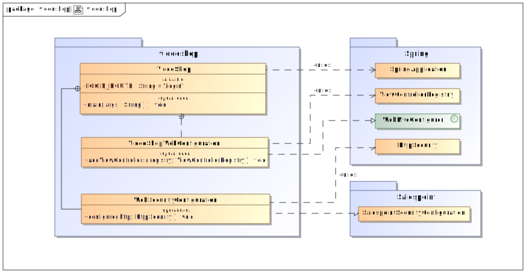

[options="header"]
|=== 
|Class/Enumeration |Description
|VideoShop|The central application class to configure the Spring container and run the application
|VideoShopWebConfiguration|Configuration class to route `/login` directly to the `login.html` template
|WebSecurityConfiguration|Configuration class to set up basic security and login/logout options
|===

=== Catalog

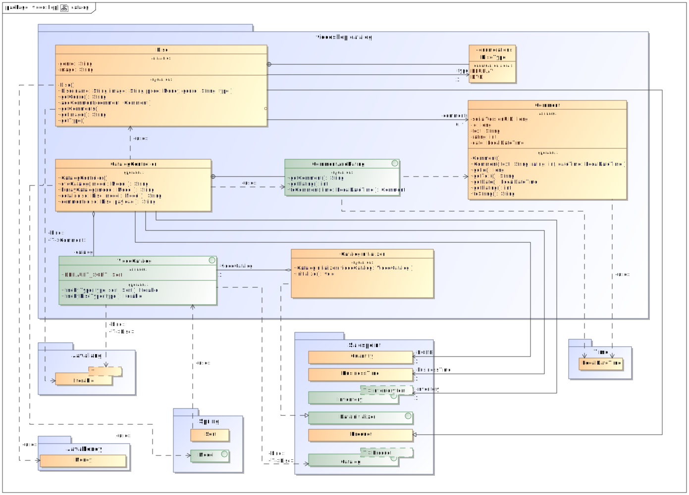

[options="header"]
|=== 
|Class/Enumeration |Description
|CatalogController |A Spring MVC Controller to handle requests to show ``Disc``s and create ``Comment``s
|CatalogInitializer |An implementation of the DataInitializer to create dummy DVDs and BluRays on application startup
|Comment |A comment which can be written for a `Disc`
|CommentAndRating |Describes the payload to be expected to add a comment
|Disc |Class to describe BluRays and DVDs as the products of the videoshop
|DiscType |Enumeration to define a `Disc` as a DVD or a BluRay
|VideoCatalog |An extension of Salespoint.Catalog to add videoshop specific queries
|===

=== Customer

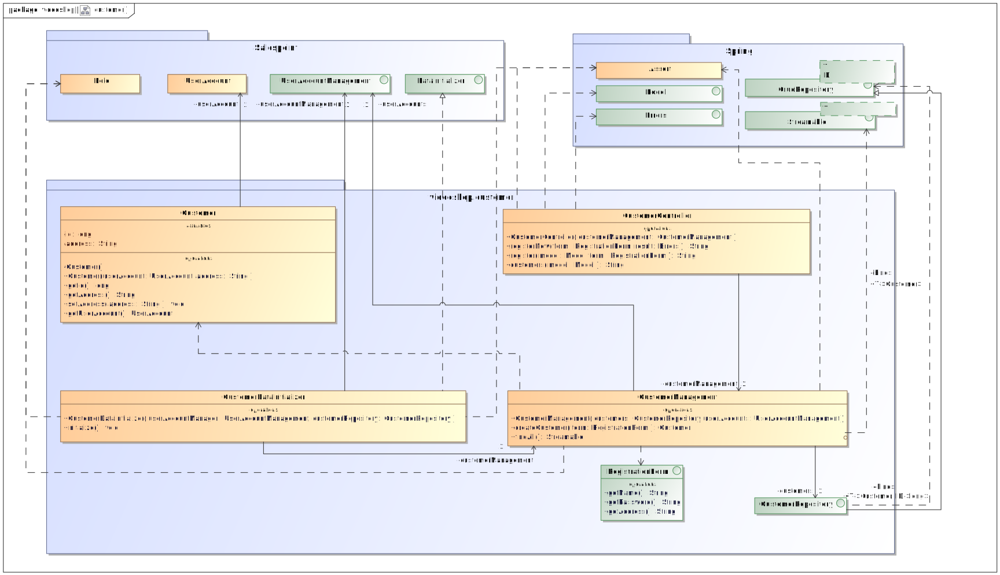

[options="header"]
|=== 
|Class/Enumeration |Description
|Customer|Custom class to extend the Salespoint-UserAccount with an address
|CustomerController|A Spring MVC Controller to handle requests to register and show customers
|CustomerDataInitializer|An implementation of the DataInitializer to create dummy customers on application startup
|CustomerManagement|Service class to manage customers
|CustomerRepository|A repository interface to manage Customer-instances
|RegistrationFrom|An interface to validate the user input of the registration formular
|===

=== Inventory

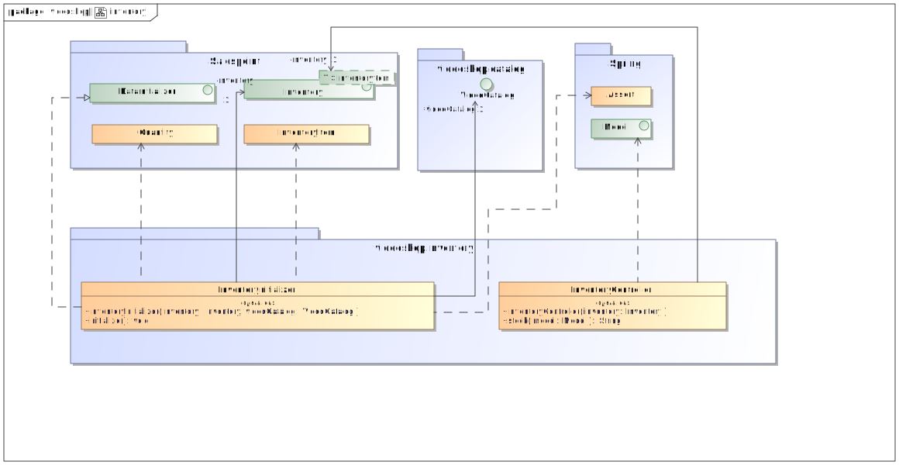

[options="header"]
|=== 
|Class/Enumeration |Description
|InventoryController|A Spring MVC Controller to handle the request to show the stock of the shop
|InventoryInitilalizer|An implementation of the DataInitializer to create dummy data on application startup
|===

=== Order

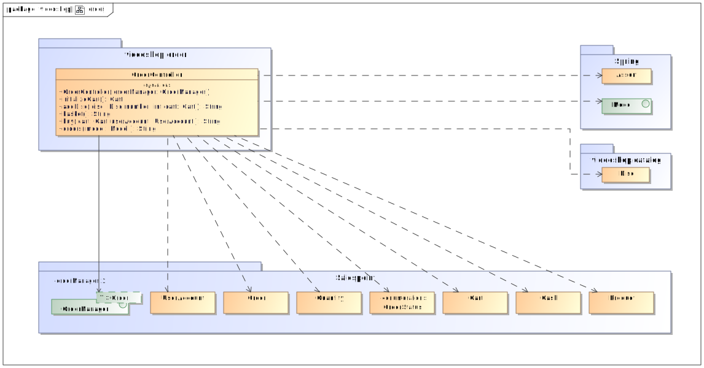

[options="header"]
|=== 
|Class/Enumeration |Description
|OrderController|A Spring MVC Controller to handle the cart
|===

=== Traceability between Analysis- and Design Model
_Note: The following table shows the Forward- and Backward Traceability from the Analysis Model to the Design Model and vice versa. If an external class is used in the design model, the kind of usage is defined in the *Usage*-Column._

[options="header"]
|===
|Class/Enumeration (Analysis Model) |Class/Enumeration (Design Model) |Usage
|BluRay                 |catalog.Disc, catalog.DiscType |
|Cart                   |Salespoint.Cart | Simple Reuse
|CartItem               |Salespoint.CartItem (part of Salespoint Implementation) | Simple Reuse
|ChargeLine             |Salespoint.ChargeLine (part of Salespoint Implementation) | Simple Reuse
|Comment                |catalog.Comment |
|Dvd                    |catalog.Disc, catalog.DiscType |
|Inventory              |Salespoint.UniqueInventory | Simple Reuse
|InventoryItem          |Salespoint.UniqueInventoryItem | Simple Reuse
|Order                  |Salespoint.Order | Simple Reuse
|OrderLine              |Salespoint.Orderline (part of Salespoint Implementation) | Simple Reuse
|OrderManager           |Salespoint.OrderManager<Order> | Simple Reuse
|OrderStatus            |Salespoint.OrderStatus | Simple Reuse
|ROLE/Role              |Salespoint.Role | Simple Reuse
|User                   |Salespoint.UserAccount, customer.Customer | Simple Reuse
|Videoshop              |videoshop.Videoshop |
|===

== Runtime view

=== Catalog
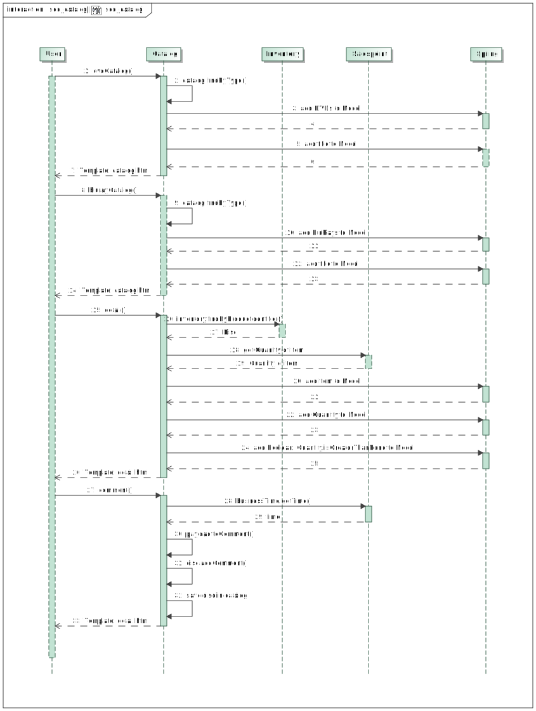

=== Customer
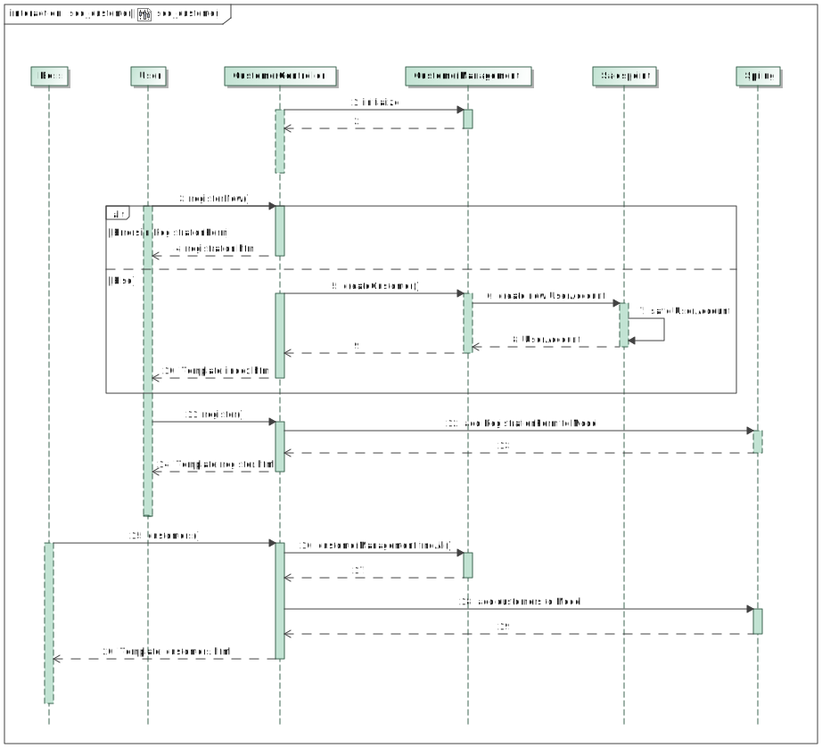

=== Inventory
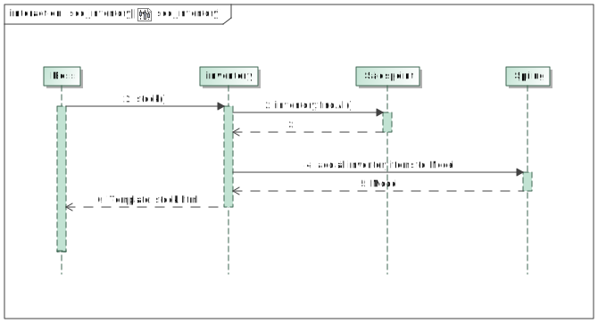

=== Order
image:diagrams/images/seq_order.svg[sequence diagram - order]

== Technical debt

=== Quality Gates
_Note: In this section, all failed Quality Gates are listed. These ratings go from *A* (best) to *E* (worst)._
[options="header"] 
|===
|Quality Gate | Actual value | Goal
|Reliability | C | A
|Coverage | 0.0% | 50.0%
|===

=== Issues
_Note: In this section, all SonarQube issues of the priority *Blocker*, *Critical* and *Major* are listed, as well as common *Minor*-Issues_
[options="header"]
[options="header", cols="1, 2, 2, 2"]
|===
|Priority |Description |Location |Corresponding Quality Gate
|Major |The return value of "orElseGet" must be used| videoshop.InventoryInitializer line 66 |Reliability
|Minor |Assign this magic number _X_ to a well-named constant, and use the constant instead a|
* 17 appearances within catalog.CatalogInitializer
* 1 appearance within inventory.InventoryInitializer
* 1 appearance within order.OrderController |None
|Minor |Lines should not be longer than 120 characters a|
* 1 appearance within catalog.Disc 
* 1 appearance within customer.Customer 
* 1 appearance within customer.RegistrationForm |None 
|===
