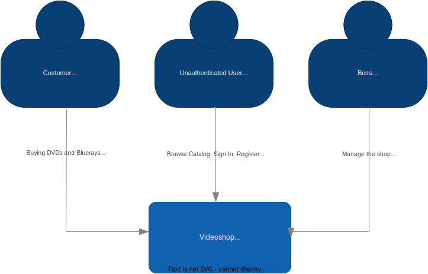
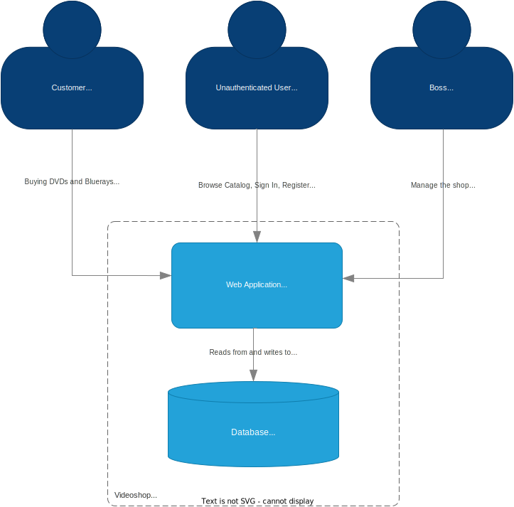
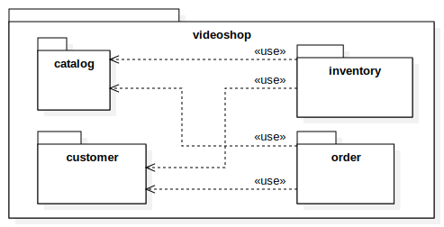

= Developer Documentation
:project_name: Videoshop
:company_name: Chair of Software Technology
:toc: left
:numbered:
:icons: font
:spring-modulith-docs: ../../../target/spring-modulith-docs

[options="header"]
[cols="1, 3, 3"]
|===
|Version
|Processing Date
|Author

|1.0
|October 29th, 2019
| Daniel Schoenicke

|2.0
|September 11th, 2023
| Markus Hamann

|2.1
|September 18th, 2024
| Oliver Geisel
|===

== Introduction
=== Task Definition

NOTE: This task aims to provide an example for the {project_name}.
It is written from the perspective of the client of this project ({company_name}) and therefore can be seen as a requirements specification.
You usually cannot expect such a document to be complete or even consistent, which is why you should always ask in case of uncertainty.
Wherever information about the domain is provided, we used _italic_ to show the representation in the domain model.

The times when people went to buy their movies physically in the store are mostly over.
As we, the {company_name}, have always had our little secondary business of selling movies to students, this change affects us as well.
Therefore, we finally want to take the leap to move our business into an online shop.
We need a software, which can support all the core aspects of our current shop and automatize processes wherever possible.

Our Shop (_Videoshop_) can have any number of users (_User_) which may interact with it differently.
Every visitor of our shop may access the catalog (_VideoCatalog_) and its whole functionality.
The catalog contains every article (_Disc_) we offer and distinguishes between DVDs (_Dvd_) and Blu-Rays (_BluRay_).
The Discs are stored in an inventory (_Inventory_), where they are represented by items (_InventoryItem_).
An item saves the current stock (_quantity_) of the Disc.
Whenever something is sold, the quantity of the item has to be reduced (_decreaseQuantity_) accordingly to represent the stock correctly.

Besides normal users in our system (_Customer_), we also want administrative access (_Boss_) to manage our shop.
Whenever a customer likes something from our catalog, he may add it (_addDisc_) to his virtual basket (_Cart_, _CartItem_) in any quantity (_quantity_) .
The contrary is obviously desired as well, to allow our customers to change their mind (_removeDisc_).
During the whole process, the customer shall obviously be able to view his selection and see total price of it (_getPrice_).
We are especially interested in the automation of the ordering process, which is why we require support for directly buying the content of the cart (_buy_).

After deciding to buy something, an order (_Order_) with the current time (_dateCreated_) is created.
It contains each of the chosen items (_OrderLine_) with their quantity (_quantity_) and price (_price_).
If the chosen item is not available in the sufficient quantity (_hasSufficientQuantity_), an error should be shown to the customer.
As long as the customer did not pay, the order is registered in the system and assigned a status (_OrderStatus_), but not yet processed (_OPEN_).
After receiving the money from the customer (_payOrder_), which he may provide through different methods (_paymentMethod_), the order may be processed further (_PAID_).
As the order is shipped to the customer, it should be archived (_completeOrder_, _COMPLETED_), as returns or refunds are ruled out :).
Should any unforeseen circumstances occur, we obviously do not want an order to be stuck in the system (_CANCELLED_).

Our shop should obviously provide the means for a visitor to register (_register_).
As we do only want registered users to have access to some functionality, a security system is required.
We do trust the state-of-the-art authentication mechanism with e-mail (_email_) and a password (_password_).
However, as we do not want to force visitors to register, they shall be able to leave a comment (_addComment_) with their opinion (_text_) and a rating (_rating_) for every disc in the catalog.

All in all, we want a nice, fast and secure system, which allows us to administrate all of our customers and the stock.
It should support our ordering process and allow us to manage everything related to it.
The user experience should be awesome, with a beautiful user interface and a layout, which boosts our sales.

== Constraints
=== Hardware Specifications
NOTE: A list of necessary devices / hardware to run and use the application.

* Server with Linux (Company)
* Computer with internet connection (End-User)
* Keyboard (End-User)
* Mouse (End-User)

=== Software Specifications
NOTE: A list of necessary software to run and use the application.

The following (or newer) Java version is necessary to run the application:

* Java 21

The following (or newer) browser versions are necessary to use the application:

* Firefox 130.0.0
* Google Chrome 131.0.0
* Chromium based browsers 130.0.0
* Opera 114.0.0
* Safari 18.0

=== Product Usage
NOTE: This section is going to give an overview of how the product is intended to be used upon completion and under which circumstances.

The system is going to be used as a web shop by the {company_name} to sell movies (discs) to students.
The software is supposed to run on a server and be available through the internet (via a browser) to interested customers 24/7.

The primary users of the software are students (customers), who supposedly know typical website navigation schemas, as well as administrators (Boss),
who do not necessarily have a technical background.

The system shall not need technical maintenance, as the staff of the {company_name} already has its hands full.
Any data shall be stored persistently in a database and be accessible through the application (e.g. no SQL knowledge should be required for a boss).

== Context and Scope
=== Context Diagram

[[context_diagram_d_c4]]

NOTE: The context model is similar to the requirement specification, since it only shows the overview of the system.
We are using the *C4* notation for all architectural models, since it holds easy to understand views of al architectural levels. Please refer to the notes in the requirement specification for C4.
If you want, you can also alternatively use the UML notation known from the course Softwaretechnologie 1.

== Solution Strategy
=== Quality Demand Fulfillment
NOTE: The following table shows the previous defined quality demands and solution approaches to fulfill them.

[options="header"]
|===
|Quality Demand |Solution approach
|Maintainability a|
* *Modularity* Compose the application out of discrete components such that changes of a component have less impact on other components.
* *Reusability* Ensure that components of the system can be reused by other components or systems.
* *Modifiabilty* Ensure that the application can be modified or extended without introducing errors or degrading the product quality.
|Usability a|
* *Learnability* Ensure that the system can be easily used and understood by its users. This can be realized by e.g. unambiguously describing the content of inputs with labels or tooltips.
* *User error protection / Error handling* Protect user against making errors. Invalid inputs must not lead to invalid system states.
* *User interface aesthetics* Provide a pleasing and satisfying interaction for the user.
* *Accessibility* Ensure that people with a wide range of characteristics can fully use the system. This can be realized by e.g. using suitable font sizes and color contrasts.
|Security a|
* *Confidentiality* Ensure that only data can be only accessed by people who are authorized to access them. This can be realized with _Spring Security_ and _Thymeleaf_ (`sec:authorize` - tag).
* *Integrity* Prevent unauthorized modification of data. This can be realized with _Spring Security_ (`@PreAuthorize` - annotation).
* *Accountability* Traceability of actions or event to an unambiguous entity or person. For this application, every
`Order` should be linked to a `Customer`.
|===

=== Software Architecture

NOTE: First, you want to give an overview of the container/components of your whole system. For this purpose you could use the *Container diagram* of C4, a more informal *Client-Server diagram*, or both._

[[container_diagram_d_c4]]

[[client_server_diagram]]
image::./diagrams/images/videoshop_client_server.svg[context diagram c4, 100%, 100%, pdfwidth=100%, title= "Client Server Model of the application. The client only contains HTML and CSS files. The application logic is implemented on the server", align=center]

*Explanation:* HTML-Templates are rendered on the server and displayed by the client with their corresponding CSS-Stylesheets. The data shown in the templates is provided by Thymeleaf. Thymeleaf receives the requested data by the controller classes, which are implemented in the backend. These controller classes on the other hand use instances and methods of the model classes. By default, an underlying H2 database saves data persistently.

NOTE: Optional JavaScript code is part of the client. *You can use JavaScript in your application but make sure that you don't use it to implement any of the application logic*!

[[component_diagram_d_c4]]
//plantuml::{spring-modulith-docs}/components.puml[format=svg,title="Top-level application architecture"]
//auto-build by spring-modulith

NOTE: The Top Level Architecture gives an overview of the components in your system (here the Web Application) and their relationships (here only to the database, but relationships between the components are possible, too).
For this purpose you could use the *Component diagram* of C4, the *Top Level Architecture diagram* from the course Softwaretechnologie 1, or both.
The components are described in detail in the chapter: 5. Building Block View.

=== Architecture decisions

==== Design Patterns
* Spring MVC

==== Persistence
The application uses *Hibernate annotation based mapping* to map Java classes to database tables. As a database, *H2* is used.
The persistence is deactivated by default. To activate persistence storage, the following two lines in the file _application.properties_ have to be uncommented:
....
# spring.datasource.url=jdbc:h2:./db/videoshop
# spring.jpa.hibernate.ddl-auto=update
....

==== User Interface

[[user-interface]]
image::./diagrams/images/dialogue_map.svg[context diagram c4, 100%, 100%, pdfwidth=100%, title= "Dialog Map of the Videoshop", align=center]

NOTE: The blue boxes display a HTML-Template. The white boxes within the templates represent buttons, which redirect to the templates, their outgoing arrows point to._

=== Use of external frameworks

NOTE: Name the used external frameworks, in which packages you used them, and why you used them in your application. You only need to describe the high level artifact.

[options="header"]
|===
|External library|Category|Description
|Spring Boot|General purpose|…
|Spring Data JPA|Persistence|…
|Spring Security|Security|…
|Semantic UI|UI|…
|jQuery|UI|…
NOTE: If you use JavaScript frameworks like Bootstrap, HTMX, etc. you have to add them to the list. The category is
mostly _UI_ and/or _Communication_.
|===

== Building block view

=== Package diagram

NOTE: If your package structure is more nested as in this example, add an *UML package diagram* to this document.
This diagram only shows the packages of the application, their containment structure, and \<<use>>-relationships between them. The goal is to give an overview of the detailed architecture.

_Example: https://www.uml-diagrams.org/multi-layered-web-architecture-uml-package-diagram-example.html_

[[package_diagram]]

NOTE: In the following sections, you will find the detailed class diagrams of the packages shown in the package diagram.
You can add some short descriptions of the classes below but the general description of the classes should be in
Java-Doc. The Java-Doc is the primary source of information for the classes. You can add a link to the doc, if it's
on a permanent location.

=== Videoshop

image:diagrams/images/videoshop.svg[class design diagram - videoshop]

=== Catalog

//plantuml::{spring-modulith-docs}/module-videoshop.catalog.puml[format=svg, title="The catalog component"]
//include::{spring-modulith-docs}/module-videoshop.catalog.adoc[]
//auto-build by spring-modulith

image:diagrams/images/catalog.svg[class design diagram - catalog]

=== Customer

//plantuml::{spring-modulith-docs}/module-videoshop.customer.puml[format=svg,title="The customer component"]
//include::{spring-modulith-docs}/module-videoshop.customer.adoc[]
//auto-build by spring-modulith

image:diagrams/images/customer.svg[class design diagram - customer]

=== Inventory

//plantuml::{spring-modulith-docs}/module-videoshop.inventory.puml[format=svg,title="The inventory component"]
//include::{spring-modulith-docs}/module-videoshop.inventory.adoc[]
//auto-build by spring-modulith

image:diagrams/images/inventory.svg[class design diagram - inventory]

=== Order

//plantuml::{spring-modulith-docs}/module-videoshop.order.puml[format=svg,title="The order component"]
//include::{spring-modulith-docs}/module-videoshop.order.adoc[]
//auto-build by spring-modulith

image:diagrams/images/order.svg[class design diagram - order]

=== Traceability between Analysis- and Design Model
NOTE: The following table shows the Forward- and Backward Traceability from the Analysis Model to the Design Model
and vice versa. Use it as a checklist to check that you did not forgot a domain concept.

[options="header"]
|===
|Class/Enumeration (Analysis Model) |Class/Enumeration (Design Model)

|BluRay                 |videoshop.catalog.DiscType
|Boss        		   a|
						* salespointframework.Role
						* salespointframework.UserAccount
|Cart                   |salespointframework.Cart
|Item                   |salespointframework.CartItem (via Salespoint.Cart)
|Comment                |videoshop.catalog.Comment
|Customer   		   a|
						* salespointframework.Role
						* videoshop.customer.Customer
|Disc             		|videoshop.catalog.Disc
|Dvd                    |videoshop.catalog.DiscType
|Image					|String
|Inventory              |salespointframework.UniqueInventory
|InventoryItem          |salespointframework.UniqueInventoryItem
|Order                  |salespointframework.Order
|Status                 |salespointframework.OrderStatus
|User/Registered User  a|
						* salespointframework.UserAccount
|VideoCatalog           |salespointframework.catalog
|Videoshop              |videoshop.Videoshop
|===

== Runtime view

NOTE: For your developer documentation you only have to create a diagram of one component, which shows the most relevant interactions.

=== Catalog
image:diagrams/images/seq_catalog.svg[sequence diagram - catalog]

=== Customer
image:diagrams/images/seq_customer.svg[sequence diagram - customer]

=== Inventory
image:diagrams/images/seq_inventory.svg[sequence diagram - inventory]

=== Order
image:diagrams/images/seq_order.svg[sequence diagram - order]

